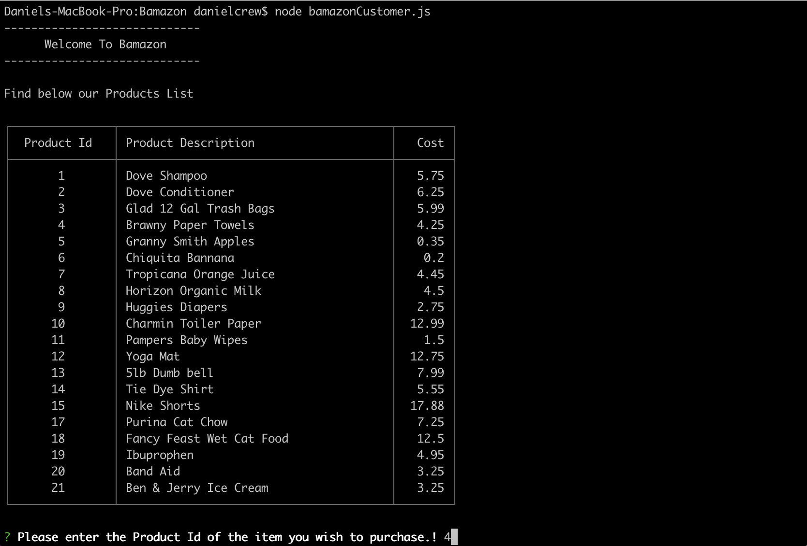
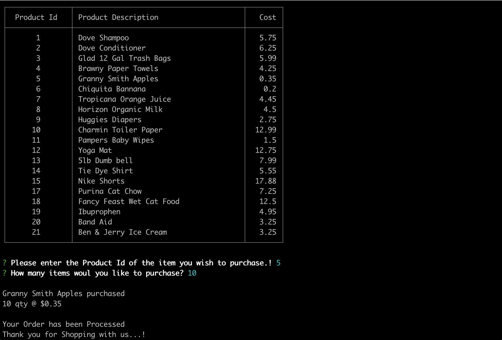
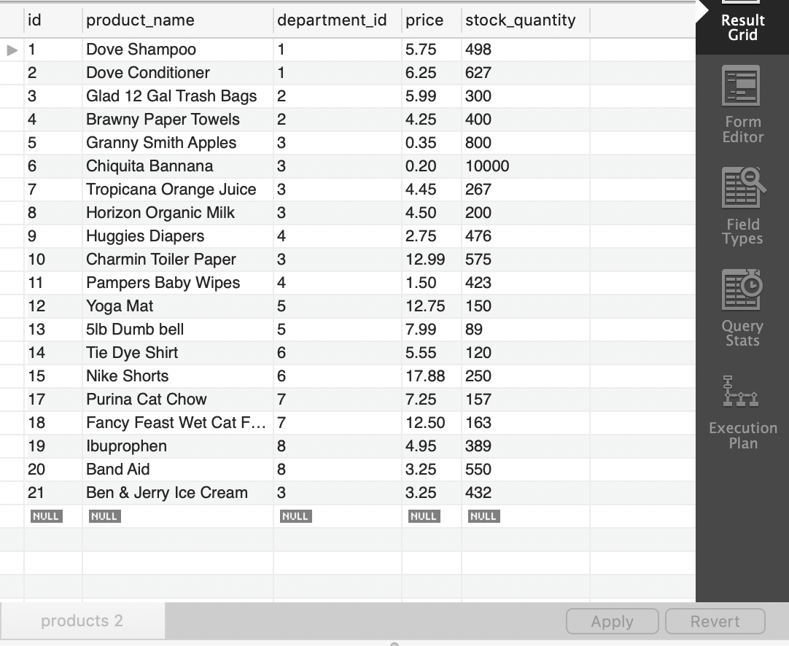
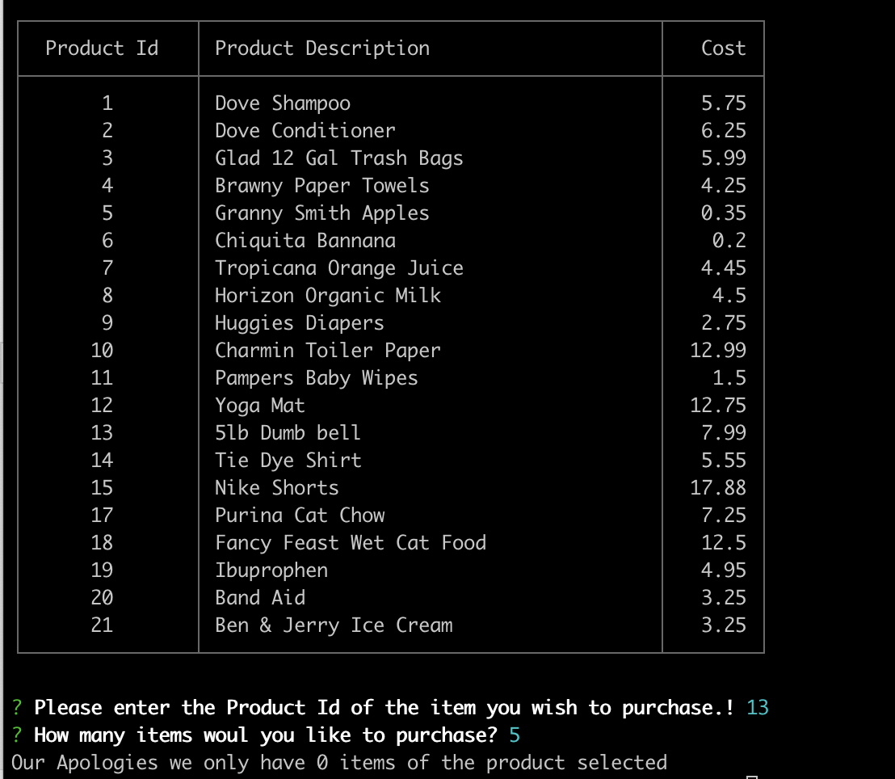

# Bamazon

### Overview

Bamazon is a market place where people can but certain items from the app as long as we are stocked with them.

###Bamazon Customer

Type node bamazonCustomer.js to enter the market place.
    

Then select product you would like to purchase by entering the "Product Id" number. Press enter and then input the amount os said product you would like to purchaes. (Note: Cost on table is for 1 item, selecting more than 1 will increase the cost by however many you would like to purchase).
    

After the purchase is complete the inventory on the app will update. I bought 10 Granny Smith Apples(id:5) and my inventory went from 800 to 790. Lots of apples still!
    (images/after.png)

If you try to buy something and you get a message like this then unfortunately we are sold out.
    